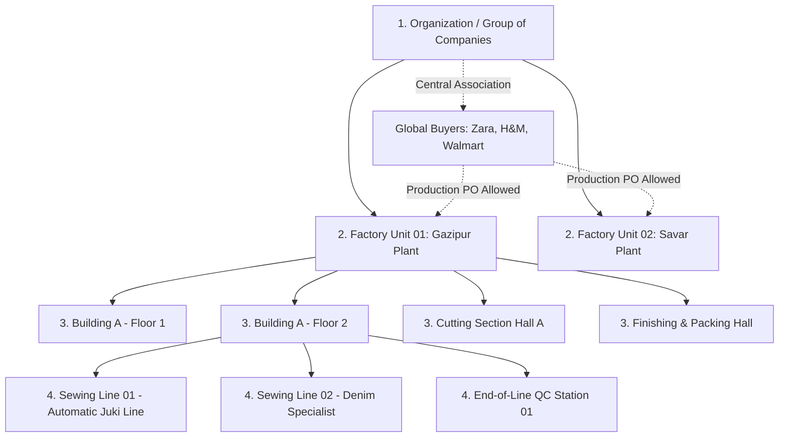

# Software Requirements Specification (SRS)
## Sub-Module: Organization Hierarchy, Multi-Unit Setup & Global Buyer Matrix
### প্রজেক্ট: TraceFlow RMG — Precision Fabric-to-Freight Garment Intelligence
**ডকুমেন্ট রেফারেন্স:** `TFRMG-SRS-ORG-V1.0`  
**মডিউল কোড:** `MOD-02-ORG` (Foundation of Enterprise Master Data)  
**স্ট্যান্ডার্ড কমপ্লায়েন্স:** ISO 9001:2015, Single-Source-of-Truth (SSOT), Multi-Tenant/Multi-Unit Manufacturing  
**স্ট্যাটাস:** Official Specification (Awaiting Executive Sponsor Sign-Off)  
**টার্গেট আর্কিটেকচার:** Laravel 13 (Repository Pattern) + PostgreSQL 17 + React 19 (Clean SPA)

---

## ১. নির্বাহী সারসংক্ষেপ (Executive Summary)

একটি বৃহৎ তৈরি পোশাক উৎপাদনকারী গ্রুপ অব কোম্পানিজে (Group of Companies) একাধিক কারখানা (Factory Units) বিভিন্ন ভৌগোলিক অবস্থানে (যেমন: গাজীপুর ক্যাম্পাস, সাভার ক্যাম্পাস, আশুলিয়া প্ল্যান্ট) পরিচালিত হয়। 

কারখানার দৈনন্দিন কার্যক্রম—অর্ডার বুকিং, কাটিং, সুইং ট্র্যাকিং, কিউসি, মার্চেন্ডাইজিং এবং শিপমেন্ট শুরু করার পূর্বশর্ত হলো **Organization & Factory Real-Estate Hierarchy** সঠিকভাবে কনফিগার করা।

এই স্পেসিফিকেশন ডকুমেন্টে ব্যবহারকারীর নির্ধারিত স্ট্রাকচার অনুযায়ী অর্গানাইজেশন সেটআপ এবং মাল্টি-ইউনিট বায়ার ম্যাট্রিক্সের পূর্ণাঙ্গ নিয়মাবলি নির্ধারণ করা হলো:

```
[ Organization / Group of Companies ] (যেমন: TraceFlow Apparels Group)
        │
        ├── [ Factory Unit / Plant ] (যেমন: Unit 01 - Gazipur | Unit 02 - Savar)
        │         │
        │         ├── [ Building & Floor ] (যেমন: Building A - 2nd Floor)
        │         │         │
        │         │         └── [ Production Lines ] (Line 01, Line 02, QC Station)
        │         └── [ Processing Sections ] (Cutting, Sewing, Finishing, Warehouse)
```

---

## ২. স্ট্র্যাটেজিক বিজনেস রুলস (Strategic Business Principles)

### ২.১ "Global Buyer, Multi-Unit Execution" নীতি (বায়ার ও মাল্টি-ইউনিট সম্পর্ক)
1. **সেন্ট্রাল বায়ার ওনারশিপ (Group-Level Registration):** 
   - বায়ার (যেমন: `H&M`, `Zara`, `Walmart`, `Target`) কোনো নির্দিষ্ট একটি ইউনিটের অধীনে তৈরি হবে না। বায়ার সরাসরি শীর্ষ **Organization / Group of Companies** লেভেলে একবারই তৈরি হবে।
2. **ক্রস-ইউনিট ক্যাপাসিটি শেয়ারিং (Any Unit can work for Any Buyer):**
   - গ্রুপের যেকোনো ফ্যাক্টরি ইউনিট (Unit 01, Unit 02, ইত্যাদি) যেকোনো অনুমোদিত বায়ারের স্টাইল, পারচেজ অর্ডার (PO) ও প্রোডাকশন পরিচালনা করতে পারবে।
3. **ক্যাপাসিটি ব্যালেন্সিং ফ্লেক্সিবিলিটি:**
   - যদি ইউনিট-০১ এ কাটিং বা সুইং লাইনের চাপ বেশি থাকে, তবে হেড অফিসের মার্চেন্ডাইজার একই বায়ারের নির্দিষ্ট স্টাইল বা লট ইউনিট-০২ এ নির্বিঘ্নে ডাইভার্ট/অ্যালোকেট করতে পারবেন।
4. **ইউনিট-ভিত্তিক ট্রেসেবিলিটি (Plant-Level Provenance):**
   - বায়ার সেন্ট্রাল হলেও প্রোডাকশনের প্রতিটি ধাপে (ফেব্রিক রোল ইস্যু, কাটিং বান্ডল টিকিট, সুইং ইনস্পেকশন, ফিনিশিং ও কার্টন কিউআর কোড) সুস্পষ্টভাবে চিহ্নিত থাকবে কাপড়টি **কোন ইউনিটে**, **কোন বিল্ডিংয়ের কোন ফ্লোরে**, এবং **কোন সুইং লাইনে** তৈরি হয়েছে।

---

## ৩. অর্গানাইজেশন হায়ারার্কির বিস্তারিত ফাংশনাল স্পেসিফিকেশন



---

### ৩.১ লেভেল ১: Organization / Group of Companies
গ্রুপ অব কোম্পানিজ হলো পুরো সিস্টেমের শীর্ষ অভিভাবক প্রতিষ্ঠান (Parent Legal Organization)।

- **REQ-ORG-001 (একক মূল সংস্থা):**
  - সিস্টেমে গ্রুপের নাম (যেমন: `TraceFlow Apparels Group`), সংক্ষিপ্ত কোড (যেমন: `TFAG`), কর্পোরেট হেড অফিস ঠিকানা, ট্রেড লাইসেন্স ও BIN/TIN তথ্য সংরক্ষিত থাকবে।
- **REQ-ORG-002 (সেন্ট্রাল পলিসি ও ডিফল্ট কনফিগারেশন):**
  - কর্পোরেট বেস কারেন্সি (ডিফল্ট: `USD` / `BDT`), আন্তর্জাতিক সময় অঞ্চল (`Asia/Dhaka`), ফিসকাল ইয়ার শুরু/শেষ।
- **REQ-ORG-003 (গ্লোবাল সুপার অ্যাডমিন কন্ট্রোল):**
  - শুধুমাত্র `Super Admin` বা `Platform Owner` অর্গানাইজেশনের কোর মেটাডাটা সম্পাদনা করতে পারবেন।

---

### ৩.২ লেভেল ২: Factory Unit / Plant
ফ্যাক্টরি ইউনিট হলো একেকটি স্বয়ংসম্পূর্ণ ফিজিক্যাল ম্যানুফ্যাকচারিং ক্যাম্পাস।

- **REQ-UNT-001 (ইউনিট প্রোফাইল ও ইউনিক আইডেন্টিফায়ার):**
  - প্রতিটি ইউনিটের একটি সংক্ষিপ্ত ইউনিক কোড থাকবে (যেমন: `UNT-GZP-01`, `UNT-SVR-02`)।
  - ইউনিটের পূর্ণ নাম (যেমন: `TraceFlow Apparels Ltd. - Unit 01`)।
- **REQ-UNT-002 (ভৌগোলিক অবস্থান ও লাইসেন্সিং):**
  - ফিজিক্যাল ফ্যাক্টরি লোকেশন (জেলা, থানা, রোড, প্লট নম্বর)।
  - বন্ডেড ওয়্যারহাউজ লাইসেন্স নম্বর (Customs Bond License No)।
  - EPZ / Non-EPZ টাইপ ক্লাসিফিকেশন।
- **REQ-UNT-003 (ফ্যাক্টরি হেড / জিএম অ্যাসাইনমেন্ট):**
  - ইউনিটের সামগ্রিক দায়িত্বপ্রাপ্ত ফ্যাক্টরি হেড / জেনারেল ম্যানেজারের অ্যাকাউন্ট (`emp_id`) ইউনিটের সাথে যুক্ত থাকবে।
- **REQ-UNT-004 (অ্যাক্টিভেশন স্ট্যাটাস):**
  - কোনো ইউনিট মেইনটেন্যান্স বা বন্ধ থাকলে তাকে `Inactive` করা যাবে, যা নতুন কাটিং বা অর্ডার লোডিং প্রতিরোধ করবে কিন্তু অতীতের ইতিহাস সংরক্ষণ করবে।

---

### ৩.৩ লেভেল ৩: Building & Floor
প্রতিটি ফ্যাক্টরি ক্যাম্পাসের ভেতরে এক বা একাধিক ভবন এবং প্রতিটি ভবনে একাধিক ফ্লোর থাকে।

- **REQ-FLR-001 (বিল্ডিং ও ফ্লোর ম্যাপিং):**
  - সংশ্লিষ্ট ইউনিটের অধীনে বিল্ডিং নাম (যেমন: `Building A`, `Main Production Building`)।
  - ফ্লোর আইডেন্টিফায়ার (যেমন: `Ground Floor`, `Floor 01`, `Floor 02`, `Floor 03`)।
- **REQ-FLR-002 (কম্পোজিট ইউনিকনেস):**
  - একই ইউনিটের একই বিল্ডিংয়ে দুটি অভিন্ন ফ্লোর নম্বর থাকতে পারবে না (`UNIQUE(unit_id, building_name, floor_number)`)।
- **REQ-FLR-003 (ফায়ার ও অকুপেন্সি সেফটি স্পেক):**
  - ফ্লোরের মোট আয়তন (Square Feet), ফায়ার এক্সিট পয়েন্ট সংখ্যা ও সর্বোচ্চ ওয়ার্কার ধারণক্ষমতা।

---

### ৩.৪ লেভেল ৪: Production Lines & Processing Sections
ফ্লোরের ভেতরের কার্যকরী উৎপাদন কেন্দ্র।

- **REQ-LIN-001 (সেকশন ক্লাসিফিকেশন):**
  - প্রতিটি ইউনিটে ৪টি প্রধান সেকশন সংজ্ঞায়িত থাকবে:
    1. **`CUTTING`**: ফ্যাব্রিক স্প্রেডিং ও কাটিং টেবিল এরিয়া।
    2. **`SEWING`**: সুইং লাইন (Line 01 থেকে Line 30)।
    3. **`FINISHING`**: থ্রেড ট্রিম, আয়রনিং ও মেটাল ডিটেকশন সেকশন।
    4. **`PACKING_WAREHOUSE`**: কার্টনিং ও ফিনিশড গুডস ওয়্যারহাউজ।
- **REQ-LIN-002 (সুইং লাইন প্রোফাইল):**
  - লাইন কোড (e.g. `LINE-SW-01`), লাইনের নাম (e.g. `Line 01 - Heavy Denim Specialist`)।
  - মোট মেশিন ও অপারেটর ক্যাপাসিটি (e.g. 60 Machines, 72 Operators)।
  - টার্গেট বেঞ্চমার্ক এফিসিয়েন্সি (e.g. 65.0%)।
  - বর্তমান লাইন চিফ / সুপারভাইজারের নাম ও `emp_id`।
- **REQ-LIN-003 (হার্ডওয়্যার ডিভাইস বাইন্ডিং):**
  - MOD-01 এ নিবন্ধিত ফ্লোর ট্যাবলেট ও কিউসি বারকোড টার্মিনালগুলো সরাসরি সংশ্লিষ্ট ইউনিটের সুনির্দিষ্ট লাইনের সাথে পেয়ার করা থাকবে।

---

### ৩.৫ বায়ার ম্যাট্রিক্স ও মাল্টি-ইউনিট অ্যালোকেশন (Buyer & Brand Master)

- **REQ-BYR-001 (সেন্ট্রাল বায়ার প্রোফাইল):**
  - বায়ার কোড (e.g. `BYR-ZARA-01`), বায়ার নাম (e.g. `Inditex - Zara`)।
  - কান্ট্রি অব হেডকোয়ার্টার্স, কারেন্সি (USD/EUR), ডিফল্ট পেমেন্ট টার্মস (LC/TT)।
- **REQ-BYR-002 (মাল্টিপল সাব-ব্র্যান্ড সাপোর্ট):**
  - বায়ারের অধীনে সাব-ব্র্যান্ড তালিকা (e.g. Zara Man, Zara Woman, Zara Kids, Pull&Bear)।
- **REQ-BYR-003 (ইউনিট অ্যালোকেশন পলিসি):**
  - **ডিফল্ট পলিসি: Global Access (All Units Enabled)** — যেকোনো ফ্যাক্টরি ইউনিট এই বায়ারের কাজ করতে পারবে।
  - **ঐচ্ছিক প্রেফারেন্স (Preferred Plant):** চাইলে কোনো বায়ারকে কোনো নির্দিষ্ট ইউনিটে "Primary Manufacturing Base" হিসেবে ট্যাগ করা যাবে।

---

## ৪. অলঙ্ঘনীয় আর্কিটেকচারাল নিয়মাবলি (Non-Negotiable Rules)

1. **নো মোডালস পলিসি (STRICT No Modals Rule):**
   - কোম্পানি সেটআপ, ইউনিট রেজিস্ট্রেশন, ফ্লোর কনফিগারেশন বা বায়ার তৈরির প্রতিটি কাজের জন্য ডেডিকেটেড ফুল-স্ক্রিন পেজ (`/master-data/organization`, `/master-data/units/create`, `/master-data/buyers/create`, ইত্যাদি) ব্যবহৃত হবে।
2. **পিউর সার্ভার-সাইড ভ্যালিডেশন (Pure Server-Side Validation):**
   - ব্রাউজারের কোনো ডিফল্ট HTML5 ভ্যালিডেশন বা পপআপ চলবে না। সমস্ত ফর্মে `<form noValidate>` থাকবে এবং ব্যাকএন্ড Laravel `FormRequest` থেকে প্রাপ্ত HTTP 422 JSON এরর ইনপুট ফিল্ডের নিচে সুনির্দিষ্টভাবে রেন্ডার হবে।
3. **সেন্ট্রাল ডিজাইন টোকেন ও ফ্ল্যাট বাটন:**
   - কোনো গ্রেডিয়েন্ট বাটন নিষিদ্ধ। `UI_TOKENS` থেকে ফ্ল্যাট সলিড কালার বাটন ব্যবহৃত হবে।
4. **টু-টিয়ার ডিলিশন ও রেফারেনশিয়াল ইন্টিগ্রিটি:**
   - যে ইউনিটে কোনো লাইভ অর্ডার বা কাটিং ডাটা রয়েছে, সেই ইউনিট বা লাইন পার্মানেন্ট ডিলিট সম্পূর্ণ ব্লক থাকবে।

---

## ৫. ডাটাবেস স্কিমা ডিজাইন (PostgreSQL 17 DDL Architecture)

```sql
-- ১. শীর্ষ সংস্থা: Organization / Group of Companies
CREATE TABLE organizations (
    id UUID PRIMARY KEY DEFAULT gen_random_uuid(),
    org_code VARCHAR(50) UNIQUE NOT NULL,
    org_name VARCHAR(150) NOT NULL,
    trade_license_no VARCHAR(100),
    bin_tin_no VARCHAR(100),
    corporate_address TEXT NOT NULL,
    contact_email VARCHAR(100),
    contact_phone VARCHAR(50),
    base_currency VARCHAR(10) DEFAULT 'USD',
    timezone VARCHAR(50) DEFAULT 'Asia/Dhaka',
    is_active BOOLEAN DEFAULT TRUE,
    created_at TIMESTAMPTZ NOT NULL DEFAULT NOW(),
    updated_at TIMESTAMPTZ NOT NULL DEFAULT NOW(),
    deleted_at TIMESTAMPTZ NULL
);

-- ২. ফ্যাক্টরি ইউনিট: Factory Units / Plants
CREATE TABLE factory_units (
    id UUID PRIMARY KEY DEFAULT gen_random_uuid(),
    org_id UUID NOT NULL REFERENCES organizations(id) ON DELETE RESTRICT,
    unit_code VARCHAR(50) UNIQUE NOT NULL,
    unit_name VARCHAR(150) NOT NULL,
    factory_type VARCHAR(50) DEFAULT 'GARMENTS', -- GARMENTS, WASHING, TEXTILE, ACCESSORIES
    epz_status VARCHAR(30) DEFAULT 'NON_EPZ', -- EPZ, NON_EPZ
    bond_license_no VARCHAR(100),
    address TEXT NOT NULL,
    city VARCHAR(100) NOT NULL,
    factory_head_emp_id VARCHAR(50),
    is_active BOOLEAN DEFAULT TRUE,
    created_at TIMESTAMPTZ NOT NULL DEFAULT NOW(),
    updated_at TIMESTAMPTZ NOT NULL DEFAULT NOW(),
    deleted_at TIMESTAMPTZ NULL
);

-- ৩. বিল্ডিং ও ফ্লোর: Buildings and Floors
CREATE TABLE factory_floors (
    id UUID PRIMARY KEY DEFAULT gen_random_uuid(),
    unit_id UUID NOT NULL REFERENCES factory_units(id) ON DELETE RESTRICT,
    building_name VARCHAR(100) NOT NULL,
    floor_number VARCHAR(50) NOT NULL,
    floor_label VARCHAR(120), -- e.g. "Building A - 2nd Floor (Sewing Hall)"
    area_sqft NUMERIC(10, 2),
    is_active BOOLEAN DEFAULT TRUE,
    created_at TIMESTAMPTZ NOT NULL DEFAULT NOW(),
    updated_at TIMESTAMPTZ NOT NULL DEFAULT NOW(),
    deleted_at TIMESTAMPTZ NULL,
    CONSTRAINT uq_floor_per_building UNIQUE (unit_id, building_name, floor_number)
);

-- ৪. প্রোডাকশন লাইন ও সেকশন: Production Lines & Sections
CREATE TABLE production_lines (
    id UUID PRIMARY KEY DEFAULT gen_random_uuid(),
    floor_id UUID NOT NULL REFERENCES factory_floors(id) ON DELETE RESTRICT,
    line_code VARCHAR(50) NOT NULL,
    line_name VARCHAR(120) NOT NULL,
    section_type VARCHAR(50) NOT NULL DEFAULT 'SEWING', -- CUTTING, SEWING, FINISHING, QC
    operator_capacity INTEGER NOT NULL DEFAULT 60,
    target_efficiency NUMERIC(5, 2) DEFAULT 65.00,
    supervisor_emp_id VARCHAR(50),
    is_active BOOLEAN DEFAULT TRUE,
    created_at TIMESTAMPTZ NOT NULL DEFAULT NOW(),
    updated_at TIMESTAMPTZ NOT NULL DEFAULT NOW(),
    deleted_at TIMESTAMPTZ NULL,
    CONSTRAINT uq_line_per_floor UNIQUE (floor_id, line_code)
);

-- ৫. সেন্ট্রাল বায়ার মাস্টার: Buyers (Organization Level)
CREATE TABLE buyers (
    id UUID PRIMARY KEY DEFAULT gen_random_uuid(),
    org_id UUID NOT NULL REFERENCES organizations(id) ON DELETE RESTRICT,
    buyer_code VARCHAR(50) UNIQUE NOT NULL,
    buyer_name VARCHAR(150) UNIQUE NOT NULL,
    country VARCHAR(100) NOT NULL,
    default_currency VARCHAR(10) DEFAULT 'USD',
    payment_terms VARCHAR(100),
    contact_person VARCHAR(100),
    contact_email VARCHAR(100),
    contact_phone VARCHAR(50),
    is_active BOOLEAN DEFAULT TRUE,
    created_at TIMESTAMPTZ NOT NULL DEFAULT NOW(),
    updated_at TIMESTAMPTZ NOT NULL DEFAULT NOW(),
    deleted_at TIMESTAMPTZ NULL
);
```

---

## ৬. স্ক্রিন ও ইউজার ফ্লো (Screen Routes & Workflow)

| রুট (Route) | পেজের নাম ও কাজ | ইউজার রোল |
| :--- | :--- | :--- |
| `/master-data/organization` | **Organization Profile:** হেড অফিস ও গ্রুপ ইনফরমেশন ভিউ ও এডিট | Super Admin, MD, CEO |
| `/master-data/units` | **Factory Units Directory:** সকল ফ্যাক্টরি ক্যাম্পাসের তালিকা ও স্ট্যাটাস | Admin, Operations Head |
| `/master-data/units/create` | **Create Factory Unit:** নতুন ফ্যাক্টরি ক্যাম্পাস রেজিস্ট্রেশন (ফুল পেজ) | Super Admin, Plant Head |
| `/master-data/units/:id/floors` | **Floor & Section Planner:** ইউনিটের বিল্ডিং, ফ্লোর ও সেকশন কনফিগারেশন | IE Manager, Factory GM |
| `/master-data/lines` | **Production Line Registry:** সকল ফ্লোরের সুইং লাইন ও ক্যাপাসিটি রেজিস্ট্রি | IE Head, Production Head |
| `/master-data/buyers` | **Global Buyer Master:** সেন্ট্রাল বায়ার ডিরেক্টরি ও ব্র্যান্ড লিস্ট | Merchandising Lead |
| `/master-data/buyers/create` | **Create Buyer Profile:** নতুন আন্তর্জাতিক বায়ার এন্ট্রি (ফুল পেজ) | Merchandising Specialist |

---

## ৭. অনুমোদন ও সাইন-অফ (Sign-Off Requirement)

এই স্পেসিফিকেশন ডকুমেন্টটি অনুমোদিত হলে, এটি হবে **MOD-02: Master Data Management**-এর সর্বপ্রধান ভিত্তি। কারখানার সমস্ত পরবর্তী অপারেশনাল মডিউল (অর্ডার, কাটিং, সুইং, কিউসি, মার্চেন্ডাইজিং) এই অর্গানাইজেশন হায়ারার্কি ও সেন্ট্রাল বায়ার ডেটার ওপর ভিত্তি করে কাজ করবে।
